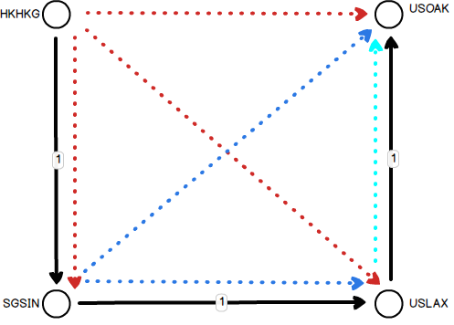

## Haven Engineering Applicant Exercise

## The Mini Project
**You can use this skeleton project as a starting point, or use another framework of your choice. The only requirement is it must be Javascript based**

Scenario:  We have several customers who are looking to book shipments with us.  They want to be able to enter a date range and find all of the voyages which are possible between those dates.  Unfortunately we only have a list of port calls - when vessels arrive and depart from each port.  Our goal is to take this list of port calls and generate all of the permutations so we can display voyages for our customers to select.

Within this repository you can find a list of the port calls (portCalls.json) for the various vessels.  A port call contains the name of the vessel, a port and the dates the vessel arrives and departs from that port.  The port calls are grouped by a routeId.  

From these port calls we can generate the list of voyages that are possible.  For example, in our data set the 'USS Harpoon' starts a route from Hong Kong (HKHKG), visit Singapore (SGSIN), Los Angeles (USLAX) and finishes in Oakland (USOAK).  The port calls would be listed as:

HKHKG  
SGSIN  
USLAX  
USOAK  

If we were to display the possible voyages it would be as follows:

HKHKG to SGSIN  
HKHKG to USLAX  
HKHKG to USOAK  
SGSIN to USLAX  
SGSIN to USOAK  
USLAX to USOAK

As a visualization these are the port calls and all of the voyages that can be generated from them:

Now, taking this problem one step further, let's consider a use case that is seen currently in the industry. 
Say you have two vessels that both pass through the port of Hong Kong. You could technically jump from one ship to the other and continue on the next ship's voyage. This is called a transshipment. For example:

Route 1: SGSIN -> HKHKG -> USLAX
Route 2: HKHKG -> USOAK -> COBOG

Your cargo is in SGSIN, and you want it delivered to COBOG. You could technically start on Route 1 in SGSIN, and when you get to HGHKG, you reload your cargo onto Route 2 and continue on your way to COBOG. There are probably some factors you would want to consider to make sure that this jump is actually possible. 

As a final part of this problem, please include a checkbox that allows you to select whether or not to display these transshipments in the results of your possible voyages. 

#### Requirements

- Convert the list of port calls into a list of possible voyages between ports
- Include a toggle to add transhipments to your result set
- Provide an interface for listing all possible voyages between two dates, showing the port pairs and vessels involved
- You are free to use the provided skeleton app or write your own.

> Do not hesitate to ask questions about how this could/should be set up! This is not a strict quiz, it is a starting point for collaboration.

#### Skeleton Overview
The skeleton provided here is a barebones [Strongloop/Loopback](https://docs.strongloop.com/display/public/LB/Getting+started+with+LoopBack) application. To help get you started we have provided boilerplate to:

- Initialize / load the data from the portCall.js file
- Provide a single stubbed API endpoint that can be modified to generate the list of voyages from the port calls
- Scaffolding for the UI layer via Angular and the loopback Angular SDK
- Date pickers for selecting the date range we want to display and a call to the API with those dates

## Getting Started
- The [Create a Simple API](https://docs.strongloop.com/display/public/LB/Create+a+simple+API) tutorial for Strongloop is a great starting point, along with [Installing Strongloop](https://docs.strongloop.com/display/public/LB/Installing+StrongLoop) and [Loopback Core Concepts](https://docs.strongloop.com/display/public/LB/LoopBack+core+concepts).
- Install [NodeJS](https://nodejs.org) on your dev machine, and make sure [npm](https://www.npmjs.com/) is also installed (it should come with most distributions of node).
- Clone this repository.
- Once cloned, install the application dependencies using `npm install` in the root of the project.
- Once installed, start the application with `npm start` - this will regenerate the loopback Angular SDK and start the server.
- Extend the stubbed remote methods inside [common/models/portCalls.js](https://github.com/HavenInc/bacchus/blob/master/common/models/portCall.js) to return the expected voyages.
- You can use the [API Explorer http://0.0.0.0:3000/explorer](http://0.0.0.0:3000/explorer) to test your new methods while in development.
- Document tradeoffs/shortcuts in the interest of time; this exercise should not take more than 2-3 hours for basic functionality.

## Bonus Options
- Add appropriate unit tests
- Create an npm run script inside package.json that uses supervisor to reload/rerun the code as you edit it.
- What would be an interesting way to present the app to the engineering team?
